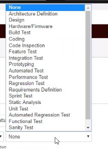
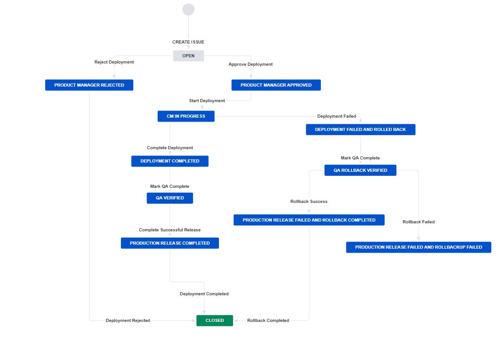

# Best Practices for Service Account Management (SAM)

#### A service account is often described as an account that does not correspond to an actual person.

## Service Account Management Best Practices

- **Identity and maintain an up-to-date repository of all service accounts** Create an authoritative source to maintain record of all service accounts. Discover service accounts and update the record.
- **Identifying owners for service accounts** Identify and assign the owner to each service account for accountability.
- **Naming service account** Consider names that are not completely obvious to the service,  for example &#39;admin&#39; would be helpful to administrators, but it is more helpful to attackers.
- **Apply the least privilege and segregation of duties (SoD) principles** Assign the only minimum required privileges to service accounts. Start with the most restrictive permissions possible and build out from there. Separation of duties means no one user can perform all privileged actions on a given application or system.
- **Password Management** Do not set accounts with password &quot;Never expires&quot; or use the same password for all the service accounts. Define a strategy for managing these passwords and changing them on a regular basis, as well as using unique passwords.
- **Manage the full life-cycle of service accounts** Follow check in/check out process for securely sharing the password to privileged users and change password of service account after every use. Also, disable inactive service accounts.
- **Classification and risk analysis of each service account** Define and classify service accounts. Map out what important applications, service or programs rely on it. Utilize the security risk assessment practices to identify the danger each privileged service account poses and focus on the riskiest ones
- **Auditing and Alerting of service account usage** Keep informed about service account activities with extensive logging and monitoring techniques.
- **Access Review Certification for service accounts** Review permissions attached to privileged service accounts periodically. Keep track of all the changes in detail.
- **Document service account management policies** Make sure your policies and account classifications are well documented and approved by management. So, they can be clear and strictly enforced.
- **Educate your employees ** Provide continuous education to your staff about any change in service account management policies, processes, and classifications. Everyone in the organization should know how to manage and use their service account credentials. Security is everyone&#39;s responsibility and is most effective when everyone understands it.

